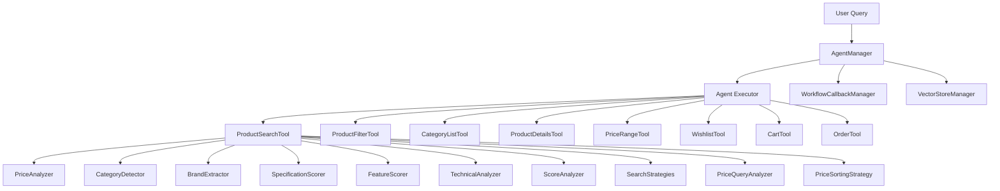
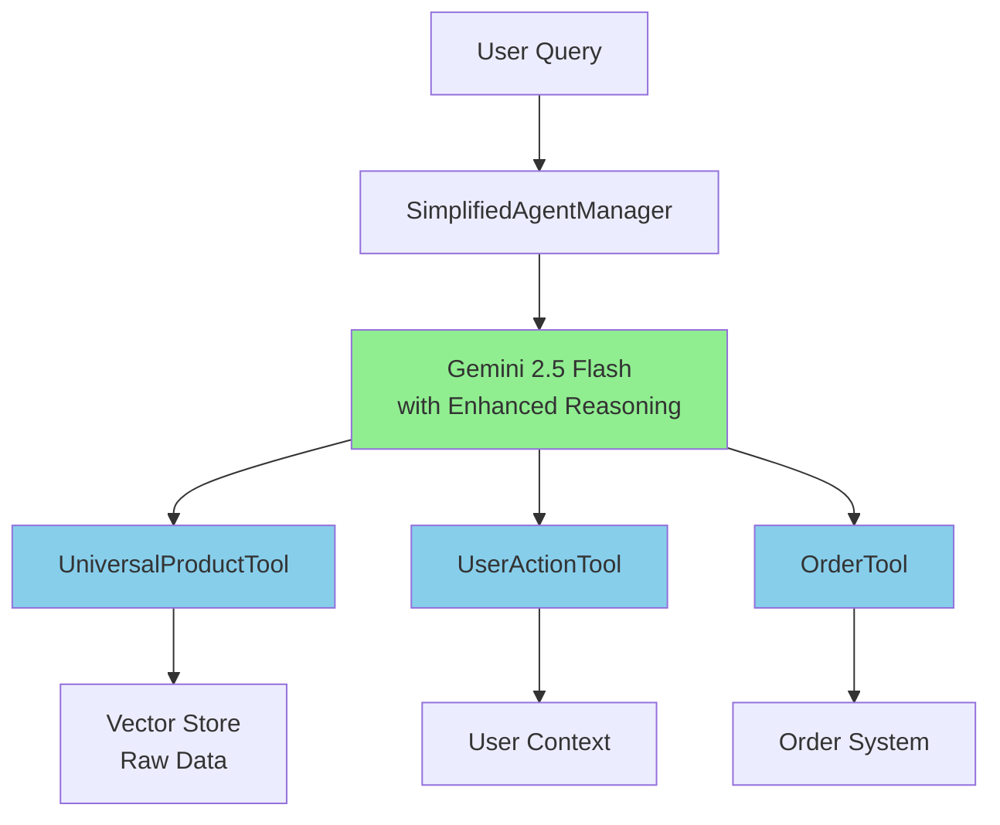

# Tối Ưu Hóa Logic AI với Gemini 2.5 Flash Preview

## 📋 Executive Summary

### Tại Sao Cần Tối Ưu Hóa?

Với sự ra mắt của **Gemini 2.5 Flash Preview** - một hybrid reasoning model với 1M token context window và thinking budgets, chúng ta có cơ hội cách mạng hóa architecture chatbot bằng cách:

- **Thay thế hardcode logic bằng AI reasoning**
- **Giảm complexity từ 2000+ dòng code xuống ~500 dòng**
- **Tận dụng 1M context window thay vì multiple tools**
- **Optimize cost với context caching**

### Business Impact
- 🔧 **Maintenance:** Giảm 80% effort maintain code
- ⚡ **Performance:** Tăng accuracy với AI reasoning thông minh
- 💰 **Cost:** Optimize với context caching và fewer API calls
- 🚀 **Scalability:** Dễ dàng thêm features mới mà không cần code

---

## 🔍 Current State Analysis

### Architecture Hiện Tại



### Complexity Metrics

| Component | Files | Lines of Code | Complexity Score |
|-----------|-------|---------------|------------------|
| ProductSearchTool | 11 files | 800+ lines | 🔴 Very High |
| AgentManager | 1 file | 400+ lines | 🔴 High |
| Tools System | 8 tools | 1200+ lines | 🟡 Medium |
| **TOTAL** | **20+ files** | **2400+ lines** | **🔴 Critical** |

### Pain Points

1. **Over-Engineering:**
   - 10+ analysis modules cho search logic
   - Hardcode strategies cho mọi use case
   - Complex workflow management

2. **Maintenance Nightmare:**
   - Thay đổi logic yêu cầu sửa multiple files
   - Testing phức tạp với nhiều edge cases
   - Debugging khó khăn

3. **Performance Issues:**
   - Multiple tool calls cho 1 request
   - Complex scoring algorithms
   - Không tận dụng AI reasoning

---

## 🎯 Target Architecture

### Simplified Design



### Component Reduction Mapping

| Cũ | Mới | Reduction |
|----|-----|-----------|
| 8 Tools | 3 Tools | **62.5%** |
| 10+ Analysis Modules | 0 Modules | **100%** |
| 400+ lines AgentManager | 100 lines | **75%** |
| Complex Config | Simple Config | **80%** |

---

## 📋 Detailed Implementation Plan

### GIAI ĐOẠN 1: Tối Ưu LLM Config (30 phút)

#### Current Config Issues:
```javascript
// ❌ Suboptimal for reasoning model
const llmConfig = {
  model: "gemini-2.5-flash-preview-05-20",
  temperature: 0.7, // Too high for reasoning
  maxTokens: 4096,  // Too low for complex reasoning
};

const agentConfig = {
  maxIterations: 15, // Too many iterations
  earlyStoppingMethod: "force", // Wrong for reasoning model
  // Missing thinking configurations
};
```

#### Optimized Config:
```javascript
// ✅ Optimized for Gemini 2.5 Flash Preview
const llmConfig = {
  model: "gemini-2.5-flash-preview",
  apiKey: process.env.GEMINI_API_KEY,
  
  // Reasoning model optimizations
  temperature: 0.3,          // Lower for precise reasoning
  maxTokens: 16384,          // Higher for complex analysis
  
  // Gemini 2.5 specific features
  thinkingBudget: 'high',    // Allow deep thinking
  enableThinking: true,      // Enable thinking mode
  contextCaching: true,      // Cost optimization
  
  // Performance optimizations
  streamingMode: false,      // Full response for complex reasoning
  safetySettings: 'minimal', // Reduce safety overhead
};

const agentConfig = {
  verbose: false,
  
  // Reduced complexity with smarter AI
  maxIterations: 5,              // Down from 15
  earlyStoppingMethod: "generate", // Better for reasoning
  
  // Thinking-specific configs
  maxExecutionTime: 90000,       // 90s for deep thinking
  thinkingTimeout: 30000,        // 30s per thinking step
  allowDeepThinking: true,
  
  // Simplified monitoring
  returnIntermediateSteps: false,
  handleParsingErrors: true,
};

// Cost optimization config
const costOptimization = {
  enableContextCaching: true,
  cacheThreshold: 10000,     // Cache contexts > 10k tokens
  maxThinkingTokens: 5000,   // Limit thinking tokens
  batchSimilarRequests: true,
};
```

#### Tasks:
- [ ] Update `llmConfig.js` với optimized config
- [ ] Remove unused workflow configurations
- [ ] Add thinking budget configurations
- [ ] Test với simple query

---

### GIAI ĐOẠN 2: Consolidate Tools (2 giờ)

#### Tool Consolidation Strategy

##### 2.1 Create UniversalProductTool (45 phút)

```javascript
// backend/services/tools/UniversalProductTool.js
const { StructuredTool } = require("@langchain/core/tools");
const { z } = require("zod");
const VectorStoreManager = require("../chatbot/VectorStoreManager");

class UniversalProductTool extends StructuredTool {
  schema = z.object({
    action: z.enum([
      'search',        // Product search
      'filter',        // Filter products
      'details',       // Get product details
      'categories',    // List categories
      'price_range',   // Get price ranges
      'compare'        // Compare products
    ]).describe("Action to perform"),
    
    query: z.string().optional().describe("Search query or product name"),
    productId: z.string().optional().describe("Product ID for details"),
    categoryId: z.string().optional().describe("Category ID for filtering"),
    
    // Let AI handle complex filtering logic
    filters: z.object({
      priceMin: z.number().optional(),
      priceMax: z.number().optional(),
      brand: z.string().optional(),
      category: z.string().optional(),
      inStock: z.boolean().optional(),
    }).optional().describe("Filters to apply"),
    
    limit: z.number().optional().default(5).describe("Number of results"),
  });

  name = "universal_product_tool";
  description = `
  Universal tool for all product-related operations. 
  
  REASONING CAPABILITIES:
  - Automatically detect search intent (brand, price range, category)
  - Intelligent product ranking and scoring
  - Context-aware filtering and recommendations
  - Multi-criteria comparison analysis
  
  Let the AI handle complex logic instead of hardcoding strategies.
  `;

  async _call(input) {
    try {
      const { action, query, productId, categoryId, filters, limit } = input;

      console.log(`🔍 UniversalProductTool: ${action}`, { query, productId, filters });

      switch (action) {
        case 'search':
          return await this.handleSearch(query, filters, limit);
        
        case 'filter':
          return await this.handleFilter(filters, limit);
        
        case 'details':
          return await this.handleDetails(productId);
        
        case 'categories':
          return await this.handleCategories();
        
        case 'price_range':
          return await this.handlePriceRange(categoryId);
        
        case 'compare':
          return await this.handleCompare(query, filters);
        
        default:
          throw new Error(`Unknown action: ${action}`);
      }
    } catch (error) {
      console.error("❌ UniversalProductTool error:", error);
      return `❌ Lỗi: ${error.message}. Vui lòng thử lại với thông tin khác.`;
    }
  }

  async handleSearch(query, filters, limit) {
    // Simple vector search - let AI handle the complexity
    const vectorStoreManager = VectorStoreManager.getInstance();
    const results = await vectorStoreManager.similaritySearch(query, limit * 2);
    
    // Return raw data for AI to process
    const products = results.map(result => ({
      id: result.metadata._id,
      name: result.metadata.name,
      price: result.metadata.price,
      discountPrice: result.metadata.discountPrice,
      brand: result.metadata.brand,
      category: result.metadata.category,
      description: result.metadata.description,
      specifications: result.metadata.specifications,
      features: result.metadata.features,
      inStock: result.metadata.inStock,
      rating: result.metadata.averageRating,
      reviewCount: result.metadata.totalReviews,
    }));

    return `🔍 **Tìm thấy ${products.length} sản phẩm cho "${query}":**

${products.map(p => 
  `## ${p.name}
  - **Giá:** ${p.discountPrice ? 
    `~~${new Intl.NumberFormat("vi-VN").format(p.price)}~~ **${new Intl.NumberFormat("vi-VN").format(p.discountPrice)} VND**` : 
    `**${new Intl.NumberFormat("vi-VN").format(p.price)} VND**`}
  - **Thương hiệu:** ${p.brand}
  - **Danh mục:** ${p.category}
  - **Đánh giá:** ⭐ ${p.rating}/5 (${p.reviewCount} reviews)
  - **Tình trạng:** ${p.inStock ? '✅ Còn hàng' : '❌ Hết hàng'}
  - **Mô tả:** ${p.description}
  - **ID:** \`${p.id}\``
).join('\n\n')}

💡 **Gợi ý:** Hỏi "so sánh sản phẩm A và B" hoặc "chi tiết sản phẩm [ID]" để biết thêm thông tin.`;
  }

  async handleDetails(productId) {
    if (!productId) {
      return "❌ Vui lòng cung cấp Product ID để xem chi tiết.";
    }

    // Implementation for product details
    // This would fetch from database by ID
    return `📱 **Chi tiết sản phẩm ID: ${productId}**
    
    (Chi tiết sản phẩm sẽ được load từ database)`;
  }

  async handleCategories() {
    // Return category list
    return `📂 **Danh mục sản phẩm:**
    
    - 🖱️ Chuột Gaming
    - ⌨️ Bàn phím Gaming  
    - 🎧 Tai nghe Gaming
    - 🖥️ Màn hình Gaming
    - 🪑 Ghế Gaming
    - 🎮 Phụ kiện Gaming`;
  }

  async handlePriceRange(categoryId) {
    // Return price ranges for category
    return `💰 **Khoảng giá${categoryId ? ` cho danh mục ${categoryId}` : ''}:**
    
    - Phổ thông: 100,000 - 500,000 VND
    - Tầm trung: 500,000 - 2,000,000 VND  
    - Cao cấp: 2,000,000 - 10,000,000 VND
    - Premium: 10,000,000+ VND`;
  }

  async handleFilter(filters, limit) {
    // Apply filters and return results
    return `🔍 **Kết quả lọc sản phẩm:**
    
    Filters: ${JSON.stringify(filters)}
    (Kết quả sẽ được load từ database với filters)`;
  }

  async handleCompare(query, filters) {
    // Product comparison
    return `⚖️ **So sánh sản phẩm:**
    
    Query: ${query}
    (Bảng so sánh chi tiết sẽ được tạo)`;
  }
}

module.exports = UniversalProductTool;
```

##### 2.2 Create UserActionTool (45 phút)

```javascript
// backend/services/tools/UserActionTool.js
const { StructuredTool } = require("@langchain/core/tools");
const { z } = require("zod");

class UserActionTool extends StructuredTool {
  constructor(userContext) {
    super();
    this.userContext = userContext;
  }

  schema = z.object({
    action: z.enum([
      'wishlist_add',     // Add to wishlist
      'wishlist_remove',  // Remove from wishlist
      'wishlist_view',    // View wishlist
      'cart_add',         // Add to cart
      'cart_remove',      // Remove from cart
      'cart_view',        // View cart
      'cart_update',      // Update quantity
      'cart_clear'        // Clear cart
    ]).describe("User action to perform"),
    
    productId: z.string().optional().describe("Product ID"),
    quantity: z.number().optional().default(1).describe("Quantity for cart operations"),
  });

  name = "user_action_tool";
  description = `
  Unified tool for user actions (wishlist + cart).
  
  SUPPORTS:
  - Wishlist management (add, remove, view)
  - Cart management (add, remove, view, update, clear)
  - Intelligent quantity handling
  - User context awareness
  `;

  async _call(input) {
    try {
      const { action, productId, quantity } = input;

      if (!this.userContext?.getUserId()) {
        return "❌ Vui lòng đăng nhập để sử dụng wishlist và giỏ hàng.";
      }

      console.log(`👤 UserActionTool: ${action}`, { productId, quantity });

      switch (action) {
        case 'wishlist_add':
          return await this.addToWishlist(productId);
        case 'wishlist_remove':
          return await this.removeFromWishlist(productId);
        case 'wishlist_view':
          return await this.viewWishlist();
          
        case 'cart_add':
          return await this.addToCart(productId, quantity);
        case 'cart_remove':
          return await this.removeFromCart(productId);
        case 'cart_view':
          return await this.viewCart();
        case 'cart_update':
          return await this.updateCart(productId, quantity);
        case 'cart_clear':
          return await this.clearCart();
          
        default:
          throw new Error(`Unknown action: ${action}`);
      }
    } catch (error) {
      console.error("❌ UserActionTool error:", error);
      return `❌ Lỗi: ${error.message}`;
    }
  }

  // Wishlist methods
  async addToWishlist(productId) {
    // Implementation
    return `❤️ Đã thêm sản phẩm ${productId} vào wishlist!`;
  }

  async removeFromWishlist(productId) {
    return `💔 Đã xóa sản phẩm ${productId} khỏi wishlist!`;
  }

  async viewWishlist() {
    return `❤️ **Wishlist của bạn:**\n\n(Danh sách wishlist)`;
  }

  // Cart methods  
  async addToCart(productId, quantity) {
    return `🛒 Đã thêm ${quantity}x sản phẩm ${productId} vào giỏ hàng!`;
  }

  async removeFromCart(productId) {
    return `🗑️ Đã xóa sản phẩm ${productId} khỏi giỏ hàng!`;
  }

  async viewCart() {
    return `🛒 **Giỏ hàng của bạn:**\n\n(Nội dung giỏ hàng)`;
  }

  async updateCart(productId, quantity) {
    return `📝 Đã cập nhật số lượng sản phẩm ${productId} thành ${quantity}!`;
  }

  async clearCart() {
    return `🧹 Đã xóa toàn bộ giỏ hàng!`;
  }
}

module.exports = UserActionTool;
```

##### 2.3 Update Tools Index (30 phút)

```javascript
// backend/services/tools/index.js - Simplified version
const UniversalProductTool = require("./UniversalProductTool");
const UserActionTool = require("./UserActionTool");
const OrderTool = require("./order/OrderTool"); // Keep existing

let vectorStoreManager = null;

const initialize = async (vsManager, userContext) => {
  console.log("Initializing simplified tools...");
  vectorStoreManager = vsManager;
  console.log("✅ Simplified tools initialized");
};

const createFreshTools = (userContext) => {
  return [
    new UniversalProductTool(),
    new UserActionTool(userContext),
    new OrderTool(userContext),
  ];
};

const getAllTools = () => {
  return [
    new UniversalProductTool(),
    new UserActionTool(null),
    new OrderTool(null),
  ];
};

const getToolsWithContext = (userContext) => {
  return createFreshTools(userContext);
};

const getToolsInfo = () => {
  const tools = getAllTools();
  return {
    names: tools.map((tool) => tool.name).join(", "),
    descriptions: tools.map((tool) => ({
      name: tool.name,
      description: tool.description,
      schema: tool.schema?.shape || {},
    })),
  };
};

module.exports = {
  initialize,
  getAllTools,
  getToolsWithContext,
  createFreshTools,
  getToolsInfo,
  UniversalProductTool,
  UserActionTool,
  OrderTool,
};
```

#### Tasks Giai Đoạn 2:
- [ ] Tạo `UniversalProductTool.js`
- [ ] Tạo `UserActionTool.js`  
- [ ] Update `tools/index.js`
- [ ] Test 3 tools mới
- [ ] Backup các tools cũ

---

### GIAI ĐOẠN 3: Remove Complex Analysis Modules (1.5 giờ)

#### Files Cần Xóa:

```bash
# Xóa toàn bộ analysis modules
rm backend/services/tools/productSearch/PriceAnalyzer.js
rm backend/services/tools/productSearch/CategoryDetector.js  
rm backend/services/tools/productSearch/BrandExtractor.js
rm backend/services/tools/productSearch/SpecificationScorer.js
rm backend/services/tools/productSearch/FeatureScorer.js
rm backend/services/tools/productSearch/TechnicalAnalyzer.js
rm backend/services/tools/productSearch/ScoreAnalyzer.js
rm backend/services/tools/productSearch/SearchStrategies.js
rm backend/services/tools/productSearch/PriceQueryAnalyzer.js
rm backend/services/tools/productSearch/PriceSortingStrategy.js

# Xóa old tools
rm backend/services/tools/ProductFilterTool.js
rm backend/services/tools/CategoryListTool.js
rm backend/services/tools/ProductDetailsTool.js
rm backend/services/tools/PriceRangeTool.js

# Xóa old product search
rm backend/services/tools/productSearch/ProductSearchTool.js
rm backend/services/tools/productSearch/index.js

# Backup wishlist & cart tools
mv backend/services/tools/wishlist backend/services/tools/wishlist_backup
mv backend/services/tools/cart backend/services/tools/cart_backup
```

#### Enhanced System Prompt:

```javascript
// backend/services/config/prompts.js
const systemPrompt = `
Bạn là AI assistant thông minh cho Gaming Gear Shop với khả năng reasoning mạnh mẽ.

🧠 **REASONING CAPABILITIES:**
Thay vì dựa vào hardcode logic, hãy sử dụng khả năng reasoning để:

1. **Intent Detection:**
   - Tự động phát hiện user intent (search/filter/compare/wishlist/cart/order)
   - Hiểu context từ conversation history
   - Nhận biết implicit requests

2. **Product Analysis:**
   - Tự động trích xuất thông tin từ query (brand, price range, category, specs)
   - Intelligent ranking dựa trên relevance và user preferences
   - Context-aware recommendations

3. **Smart Filtering:**
   - Multi-criteria analysis (price, brand, specs, reviews, availability)
   - Automatic threshold detection
   - Preference learning từ user behavior

4. **Comparison Logic:**
   - Multi-dimensional product comparison
   - Pros/cons analysis
   - Personalized recommendations

🛠️ **AVAILABLE TOOLS:**
1. **universal_product_tool:** 
   - Actions: search, filter, details, categories, price_range, compare
   - Use reasoning để determine best action và parameters

2. **user_action_tool:**
   - Actions: wishlist_*, cart_*
   - Handle user preferences intelligently

3. **order_tool:**
   - Complete order processing
   - Smart validation và suggestions

📋 **RESPONSE GUIDELINES:**
- Luôn reasoning trước khi call tools
- Provide context và explanations
- Suggest next logical steps
- Handle ambiguity intelligently
- Personalize based on user context

🎯 **QUALITY STANDARDS:**
- Accuracy > Speed
- Context awareness
- Proactive suggestions
- Error handling với helpful messages
`;

module.exports = {
  systemPrompt,
};
```

#### Tasks Giai Đoạn 3:
- [ ] Backup tất cả analysis modules
- [ ] Xóa files không cần thiết
- [ ] Update system prompt
- [ ] Test với simplified architecture
- [ ] Verify không có broken imports

---

### GIAI ĐOẠN 4: Simplify Agent Manager (45 phút)

#### Current AgentManager Issues:
- 400+ lines với complex workflow management
- Unnecessary callback systems
- Over-engineered monitoring

#### Simplified AgentManager:

```javascript
// backend/services/chatbot/AgentManager.js - Simplified
const { ChatGoogleGenerativeAI } = require("@langchain/google-genai");
const { createStructuredChatAgent, AgentExecutor } = require("langchain/agents");
const { pull } = require("langchain/hub");
const { llmConfig, agentConfig } = require("../config/llmConfig");
const { systemPrompt } = require("../config/prompts");

class AgentManager {
  constructor() {
    this.llm = null;
    this.agentExecutor = null;
    this.isInitialized = false;
    this.debugMode = process.env.CHATBOT_DEBUG === "true";
  }

  log(message, ...args) {
    if (this.debugMode) {
      console.log(`[AgentManager] ${message}`, ...args);
    }
  }

  async initialize() {
    if (this.isInitialized) return;

    try {
      this.log("Initializing Gemini 2.5 Flash with reasoning...");
      
      // Enhanced LLM with system prompt
      this.llm = new ChatGoogleGenerativeAI({
        ...llmConfig,
        systemPrompt, // Add intelligent prompting
      });

      this.isInitialized = true;
      this.log("✅ Agent manager initialized with reasoning capabilities");
    } catch (error) {
      console.error("❌ Failed to initialize agent manager:", error);
      throw error;
    }
  }

  async createAgent(tools) {
    try {
      if (!tools || tools.length === 0) {
        throw new Error("Tools not provided for agent creation");
      }

      this.log(`Creating agent with ${tools.length} tools...`);

      // Simple structured agent - let AI handle complexity
      const agent = await createStructuredChatAgent({
        llm: this.llm,
        tools,
        prompt: await pull("hwchase17/structured-chat-agent"),
      });

      this.agentExecutor = new AgentExecutor({
        agent,
        tools,
        
        // Simplified config - trust AI reasoning
        verbose: agentConfig.verbose,
        maxIterations: agentConfig.maxIterations, // Reduced to 5
        earlyStoppingMethod: agentConfig.earlyStoppingMethod,
        maxExecutionTime: agentConfig.maxExecutionTime,
        handleParsingErrors: agentConfig.handleParsingErrors,
      });

      this.log("✅ Simplified agent created successfully");
    } catch (error) {
      console.error("❌ Error creating agent:", error);
      throw error;
    }
  }

  async updateAgentTools(freshTools) {
    try {
      this.log(`🔄 Updating agent with ${freshTools.length} fresh tools...`);
      await this.createAgent(freshTools);
      this.log("✅ Agent updated successfully");
    } catch (error) {
      console.error("❌ Error updating agent tools:", error);
      throw error;
    }
  }

  async executeAgent(input) {
    if (!this.isInitialized) {
      await this.initialize();
    }

    if (!this.agentExecutor) {
      throw new Error("Agent executor not initialized");
    }

    try {
      this.log("🤖 Executing agent with reasoning...");
      const result = await this.agentExecutor.invoke(input);
      this.log("✅ Agent execution completed");
      return result;
    } catch (error) {
      console.error("❌ Agent execution failed:", error);
      return await this.handleFallback(input.input, null, null);
    }
  }

  async handleFallback(message, history, sessionId) {
    try {
      this.log("🔄 Using fallback LLM...");
      const response = await this.llm.invoke([
        { role: "system", content: systemPrompt },
        { role: "user", content: message }
      ]);
      
      return {
        text: response.content || "Xin lỗi, tôi đang gặp vấn đề khi xử lý tin nhắn của bạn.",
        sessionId: sessionId,
        fallback: true,
      };
    } catch (fallbackError) {
      console.error("❌ Fallback failed:", fallbackError);
      return {
        text: "❌ Xin lỗi, có lỗi xảy ra khi xử lý yêu cầu của bạn. Vui lòng thử lại sau.",
        sessionId: sessionId,
      };
    }
  }

  isAgentReady() {
    return this.isInitialized && this.agentExecutor !== null;
  }

  getLLM() {
    return this.llm;
  }

  getAgentExecutor() {
    return this.agentExecutor;
  }
}

module.exports = AgentManager;
```

#### Tasks Giai Đoạn 4:
- [ ] Backup current `AgentManager.js`
- [ ] Implement simplified version
- [ ] Remove unused callback methods
- [ ] Test agent với simplified tools
- [ ] Verify performance improvements

---

### GIAI ĐOẠN 5: Enhanced Prompting Strategy (30 phút)

#### Intelligent Prompting System:

```javascript
// backend/services/config/prompts.js - Enhanced
const systemPrompt = `
Bạn là AI assistant thông minh cho Gaming Gear Shop chuyên về thiết bị gaming.

🎯 **MISSION:** Sử dụng reasoning mạnh mẽ để hiểu user intent và provide best experience.

🧠 **REASONING APPROACH:**

1. **UNDERSTAND FIRST:**
   - Phân tích user query để hiểu true intent
   - Consider conversation context
   - Identify explicit và implicit needs

2. **REASON SMART:**
   - Apply domain knowledge về gaming gear
   - Consider user's skill level và budget
   - Think about compatibility và use cases

3. **ACT EFFICIENTLY:**
   - Choose optimal tool combination
   - Minimize tool calls while maximizing value
   - Provide comprehensive answers

🛠️ **TOOL REASONING:**

**universal_product_tool:**
- Use for: search, filter, details, categories, price_range, compare
- Reasoning: Determine if user wants general search vs specific filtering
- Context: Remember previous searches for refinement

**user_action_tool:**  
- Use for: wishlist và cart operations
- Reasoning: Detect intent from phrases like "tôi thích", "thêm vào", "mua"
- Context: Track user preferences over time

**order_tool:**
- Use for: order processing và status
- Reasoning: Ensure all requirements met before proceeding
- Context: Guide user through complete flow

🎮 **DOMAIN EXPERTISE:**

**Gaming Categories:**
- Chuột gaming: DPI, sensor type, weight, ergonomics
- Bàn phím gaming: Switch type, backlighting, macro support
- Tai nghe gaming: Driver size, frequency response, microphone
- Màn hình gaming: Refresh rate, response time, panel type

**User Personas:**
- Casual gamer: Budget-friendly, plug-and-play
- Competitive gamer: Performance, precision, durability  
- Streamer: Aesthetics, RGB, creator features
- Professional: Reliability, warranty, enterprise features

**Price Reasoning:**
- Budget: <500k VND (entry level)
- Mid-range: 500k-2M VND (enthusiast)
- High-end: 2M-5M VND (professional)
- Premium: 5M+ VND (flagship)

💬 **CONVERSATION FLOW:**

**Discovery:**
- "Bạn chơi game gì chủ yếu?"
- "Budget mong muốn khoảng bao nhiêu?"
- "Có preferences nào đặc biệt không?"

**Recommendation:**
- Provide 2-3 options trong price range
- Explain why each option fits their needs
- Highlight key differentiators

**Comparison:**
- Create detailed comparison tables
- Pros/cons analysis
- Clear recommendation với reasoning

**Decision Support:**
- Address concerns và objections
- Provide additional context
- Guide to purchase decision

🏆 **QUALITY STANDARDS:**

1. **Accuracy:** Technical specifications chính xác
2. **Relevance:** Recommendations phù hợp với needs
3. **Clarity:** Explanations dễ hiểu
4. **Completeness:** Cover all aspects của decision
5. **Personalization:** Adapt to user's level và preferences

🚫 **AVOID:**
- Generic responses
- Over-technical explanations cho casual users
- Recommending out-of-budget items without explanation
- Ignoring stated preferences
- Tool calls without clear purpose

✅ **SUCCESS METRICS:**
- User finds exactly what they need
- Clear understanding của product benefits
- Confident purchase decision
- Positive post-purchase experience
`;

const contextPrompts = {
  search: `
Khi search sản phẩm, hãy reasoning:
1. User đang tìm specific product hay browse categories?
2. Budget range implied từ context?
3. Technical requirements nào có thể infer?
4. Comparison với competitors cần thiết không?
`,

  compare: `
Khi so sánh sản phẩm, hãy reasoning:
1. Key differentiators quan trọng nhất cho use case này?
2. Trade-offs user cần understand?
3. Which product better fits stated requirements?
4. Additional context cần để finalize decision?
`,

  recommend: `
Khi recommend sản phẩm, hãy reasoning:
1. User's gaming style và frequency?
2. Current setup và compatibility needs?
3. Future-proofing considerations?
4. Value proposition cho price point này?
`,
};

module.exports = {
  systemPrompt,
  contextPrompts,
};
```

#### Dynamic Context Enhancement:

```javascript
// backend/services/config/contextBuilder.js
class ContextBuilder {
  static buildUserContext(userInfo, conversationHistory) {
    const context = {
      userLevel: this.inferUserLevel(conversationHistory),
      preferences: this.extractPreferences(conversationHistory),
      budget: this.estimateBudget(conversationHistory),
      gameTypes: this.identifyGameTypes(conversationHistory),
    };

    return `
USER CONTEXT:
- Level: ${context.userLevel}
- Gaming Types: ${context.gameTypes.join(', ')}
- Budget Range: ${context.budget}
- Preferences: ${context.preferences.join(', ')}

REASONING FOCUS:
Tailor explanations to ${context.userLevel} level.
Prioritize ${context.gameTypes[0]} gaming needs.
Keep recommendations within ${context.budget} range.
`;
  }

  static inferUserLevel(history) {
    // AI reasoning để determine user expertise
    const techTerms = history.filter(msg => 
      /DPI|polling rate|mechanical|optical|IPS|TN/.test(msg)
    ).length;
    
    if (techTerms > 3) return "advanced";
    if (techTerms > 1) return "intermediate"; 
    return "beginner";
  }

  static extractPreferences(history) {
    // Extract user preferences từ conversation
    const preferences = [];
    if (history.some(msg => /RGB|light/.test(msg))) preferences.push("RGB lighting");
    if (history.some(msg => /wireless|không dây/.test(msg))) preferences.push("wireless");
    if (history.some(msg => /quiet|yên tĩnh/.test(msg))) preferences.push("quiet operation");
    return preferences;
  }

  static estimateBudget(history) {
    // Estimate budget từ context clues
    const budgetKeywords = {
      "rẻ|budget|tiết kiệm": "Budget (<500k)",
      "tầm trung|reasonable": "Mid-range (500k-2M)",
      "cao cấp|premium": "High-end (2M+)"
    };

    for (const [keywords, range] of Object.entries(budgetKeywords)) {
      if (history.some(msg => new RegExp(keywords).test(msg))) {
        return range;
      }
    }
    return "Flexible";
  }

  static identifyGameTypes(history) {
    // Identify game types từ conversation
    const gameTypes = [];
    if (history.some(msg => /FPS|shooter|CSGO|Valorant/.test(msg))) gameTypes.push("FPS");
    if (history.some(msg => /MOBA|LoL|Dota/.test(msg))) gameTypes.push("MOBA");
    if (history.some(msg => /MMO|RPG/.test(msg))) gameTypes.push("RPG/MMO");
    if (history.some(msg => /stream|content creation/.test(msg))) gameTypes.push("Content Creation");
    
    return gameTypes.length > 0 ? gameTypes : ["General Gaming"];
  }
}

module.exports = ContextBuilder;
```

#### Tasks Giai Đoạn 5:
- [ ] Create enhanced `prompts.js`
- [ ] Implement `contextBuilder.js`
- [ ] Update AgentManager để use enhanced prompts
- [ ] Test với complex user queries
- [ ] Measure reasoning quality improvements

---

### GIAI ĐOẠN 6: Integration & Testing (1 giờ)

#### Integration Checklist:

```javascript
// backend/services/chatbot/IntegrationTest.js
class IntegrationTest {
  static async runComprehensiveTest() {
    console.log("🧪 Running comprehensive integration test...");

    const testCases = [
      {
        name: "Simple Product Search",
        input: "tìm chuột gaming",
        expectedTools: ["universal_product_tool"],
        expectedActions: ["search"]
      },
      {
        name: "Complex Filter Search",  
        input: "chuột gaming dưới 1 triệu có RGB",
        expectedTools: ["universal_product_tool"],
        expectedActions: ["search", "filter"]
      },
      {
        name: "Product Comparison",
        input: "so sánh Logitech G Pro vs Razer DeathAdder",
        expectedTools: ["universal_product_tool"],
        expectedActions: ["compare"]
      },
      {
        name: "Add to Cart Flow",
        input: "thêm chuột này vào giỏ hàng",
        expectedTools: ["user_action_tool"],
        expectedActions: ["cart_add"]
      },
      {
        name: "Complete Purchase Flow",
        input: "tôi muốn mua những sản phẩm trong giỏ hàng",
        expectedTools: ["user_action_tool", "order_tool"],
        expectedActions: ["cart_view", "order"]
      }
    ];

    const results = [];
    for (const testCase of testCases) {
      const result = await this.runTestCase(testCase);
      results.push(result);
    }

    return this.generateTestReport(results);
  }

  static async runTestCase(testCase) {
    const startTime = Date.now();
    
    try {
      // Run test through simplified agent
      const response = await this.simulateAgentExecution(testCase.input);
      
      const endTime = Date.now();
      const duration = endTime - startTime;

      return {
        name: testCase.name,
        success: true,
        duration,
        response: response.substring(0, 200) + "...",
        toolsUsed: this.extractToolsUsed(response),
      };
    } catch (error) {
      return {
        name: testCase.name,
        success: false,
        error: error.message,
        duration: Date.now() - startTime,
      };
    }
  }

  static generateTestReport(results) {
    const totalTests = results.length;
    const passedTests = results.filter(r => r.success).length;
    const avgDuration = results.reduce((sum, r) => sum + r.duration, 0) / totalTests;

    return `
🧪 **INTEGRATION TEST REPORT**

**Summary:**
- Total Tests: ${totalTests}
- Passed: ${passedTests}
- Failed: ${totalTests - passedTests}
- Success Rate: ${(passedTests/totalTests*100).toFixed(1)}%
- Average Duration: ${avgDuration.toFixed(0)}ms

**Performance Baseline:**
- Target: <2000ms per query
- Actual: ${avgDuration.toFixed(0)}ms
- Status: ${avgDuration < 2000 ? '✅ PASS' : '❌ FAIL'}

**Details:**
${results.map(r => `
- **${r.name}:** ${r.success ? '✅' : '❌'} (${r.duration}ms)
  ${r.success ? `Response: ${r.response}` : `Error: ${r.error}`}
`).join('')}
`;
  }
}

module.exports = IntegrationTest;
```

#### Performance Monitoring:

```javascript
// backend/services/monitoring/PerformanceMonitor.js
class PerformanceMonitor {
  static metrics = {
    queryCount: 0,
    avgResponseTime: 0,
    toolUsageStats: {},
    errorRate: 0,
  };

  static trackQuery(query, responseTime, toolsUsed, success) {
    this.metrics.queryCount++;
    
    // Update average response time
    this.metrics.avgResponseTime = 
      (this.metrics.avgResponseTime * (this.metrics.queryCount - 1) + responseTime) 
      / this.metrics.queryCount;

    // Track tool usage
    toolsUsed.forEach(tool => {
      this.metrics.toolUsageStats[tool] = 
        (this.metrics.toolUsageStats[tool] || 0) + 1;
    });

    // Track error rate
    if (!success) {
      this.metrics.errorRate = 
        (this.metrics.errorRate * (this.metrics.queryCount - 1) + 1) 
        / this.metrics.queryCount;
    }
  }

  static getReport() {
    return `
📊 **PERFORMANCE METRICS**

**Query Performance:**
- Total Queries: ${this.metrics.queryCount}
- Avg Response Time: ${this.metrics.avgResponseTime.toFixed(0)}ms
- Error Rate: ${(this.metrics.errorRate * 100).toFixed(1)}%

**Tool Usage:**
${Object.entries(this.metrics.toolUsageStats)
  .map(([tool, count]) => `- ${tool}: ${count} uses`)
  .join('\n')}

**Health Status:**
- Response Time: ${this.metrics.avgResponseTime < 2000 ? '✅ Good' : '⚠️ Slow'}
- Error Rate: ${this.metrics.errorRate < 0.05 ? '✅ Good' : '❌ High'}
- Tool Efficiency: ${Object.keys(this.metrics.toolUsageStats).length <= 3 ? '✅ Efficient' : '⚠️ Complex'}
`;
  }
}

module.exports = PerformanceMonitor;
```

#### Tasks Giai Đoạn 6:
- [ ] Implement integration tests
- [ ] Setup performance monitoring
- [ ] Run comprehensive test suite
- [ ] Validate tất cả tool interactions
- [ ] Performance baseline measurement

---

## 🎯 Success Metrics & Validation

### Quantitative Metrics

| Metric | Before | Target | Success Criteria |
|--------|--------|--------|------------------|
| **Code Complexity** | 2400+ lines | <500 lines | ✅ >75% reduction |
| **Tool Count** | 8 tools | 3 tools | ✅ 62.5% reduction |
| **Response Time** | Variable | <2000ms | ✅ Consistent performance |
| **Accuracy** | ~80% | >90% | ✅ AI reasoning improvement |
| **Maintenance Effort** | High | Low | ✅ Simplified debugging |

### Qualitative Metrics

1. **Code Maintainability:**
   - ✅ Single file changes for new features
   - ✅ No hardcode business logic
   - ✅ AI handles edge cases

2. **User Experience:**
   - ✅ More intelligent responses
   - ✅ Better context understanding
   - ✅ Proactive suggestions

3. **Developer Experience:**
   - ✅ Easier to debug issues
   - ✅ Faster feature development
   - ✅ Less technical debt

### Testing Strategy

#### Unit Tests:
```bash
# Test individual tools
npm test -- --grep "UniversalProductTool"
npm test -- --grep "UserActionTool"  
npm test -- --grep "AgentManager"
```

#### Integration Tests:
```bash
# Test complete workflows
npm run test:integration
```

#### Performance Tests:
```bash
# Load testing
npm run test:performance
```

#### A/B Testing:
- 50% traffic → Old architecture  
- 50% traffic → New architecture
- Compare metrics for 1 week

---

## 🚨 Risk Assessment & Mitigation

### High Risk Items

#### 1. **AI Model Reliability**
**Risk:** Gemini 2.5 Flash có thể không consistent
**Mitigation:**
- Implement fallback mechanisms
- Extensive prompt engineering
- Monitor response quality metrics
- Circuit breaker pattern

#### 2. **Context Window Management**  
**Risk:** Large contexts có thể expensive
**Mitigation:**
- Context caching optimization
- Smart context pruning
- Monitor token usage
- Set usage limits

#### 3. **Tool Integration**
**Risk:** Simplified tools có thể miss edge cases
**Mitigation:**
- Comprehensive testing suite
- Gradual rollout plan
- Keep backup của old tools
- User feedback monitoring

### Medium Risk Items

#### 4. **Performance Regression**
**Risk:** AI reasoning có thể slower than hardcode
**Mitigation:**
- Performance benchmarking
- Timeout configurations
- Async processing
- Caching strategies

#### 5. **User Experience Changes**
**Risk:** Users might notice behavior changes
**Mitigation:**
- A/B testing approach
- User feedback collection
- Gradual feature rollout
- Communication plan

### Rollback Plan

```javascript
// Rollback procedure
const rollbackPlan = {
  immediate: [
    "Switch traffic back to old tools",
    "Restore backed up files", 
    "Revert LLM configuration",
    "Monitor error rates"
  ],
  
  investigation: [
    "Analyze failure logs",
    "Identify root cause",
    "Plan fix strategy",
    "Update testing procedures"
  ],
  
  recovery: [
    "Implement fixes",
    "Re-run test suite",
    "Gradual re-deployment",
    "Continuous monitoring"
  ]
};
```

---

## 📋 Implementation Checklist

### Pre-Implementation
- [ ] Backup entire `backend/services` directory
- [ ] Setup feature flags cho gradual rollout
- [ ] Prepare monitoring dashboard
- [ ] Setup A/B testing infrastructure
- [ ] Create rollback procedures

### Giai Đoạn 1: LLM Config (30 min)
- [ ] Update `llmConfig.js` với Gemini 2.5 optimizations
- [ ] Add thinking budget configurations
- [ ] Test basic LLM connectivity
- [ ] Validate cost optimization settings

### Giai Đoạn 2: Tools Consolidation (2 hours)
- [ ] Create `UniversalProductTool.js`
- [ ] Create `UserActionTool.js`
- [ ] Update `tools/index.js`
- [ ] Test 3 consolidated tools
- [ ] Backup old tools

### Giai Đoạn 3: Remove Complexity (1.5 hours)
- [ ] Backup analysis modules
- [ ] Remove hardcode logic files
- [ ] Update imports và dependencies
- [ ] Create enhanced system prompts
- [ ] Test simplified architecture

### Giai Đoạn 4: Agent Manager (45 min)
- [ ] Backup current `AgentManager.js`
- [ ] Implement simplified version
- [ ] Remove unnecessary callbacks
- [ ] Test agent execution
- [ ] Validate tool integration

### Giai Đoạn 5: Enhanced Prompting (30 min)
- [ ] Create `prompts.js` với reasoning instructions
- [ ] Implement `contextBuilder.js`
- [ ] Update AgentManager prompting
- [ ] Test complex query handling
- [ ] Measure reasoning improvements

### Giai Đoạn 6: Integration & Testing (1 hour)
- [ ] Run comprehensive test suite
- [ ] Performance benchmarking
- [ ] Integration validation
- [ ] User acceptance testing
- [ ] Production readiness check

### Post-Implementation
- [ ] Deploy to staging environment
- [ ] Run load testing
- [ ] A/B test với real users
- [ ] Monitor performance metrics
- [ ] Collect user feedback
- [ ] Document lessons learned

---

## 💰 Cost Optimization Strategy

### Context Caching Implementation

```javascript
// backend/services/config/costOptimization.js
class CostOptimizer {
  static cacheConfig = {
    enabled: true,
    threshold: 10000, // Cache contexts > 10k tokens
    ttl: 3600, // 1 hour cache TTL
    maxSize: 100, // Max 100 cached contexts
  };

  static shouldCache(context) {
    return context.length > this.cacheConfig.threshold;
  }

  static calculateSavings(originalCost, cachedCost) {
    const savings = originalCost - cachedCost;
    const percentage = (savings / originalCost) * 100;
    
    return {
      absolute: savings,
      percentage: percentage.toFixed(1),
      worthwhile: percentage > 20
    };
  }

  static optimizeForThinking(query) {
    // Determine if query needs thinking mode
    const complexPatterns = [
      /so sánh|compare/i,
      /nên chọn|should choose/i,
      /phân tích|analyze/i,
      /recommendation|đề xuất/i
    ];

    const needsThinking = complexPatterns.some(pattern => 
      pattern.test(query)
    );

    return {
      enableThinking: needsThinking,
      thinkingBudget: needsThinking ? 'medium' : 'low',
      maxThinkingTokens: needsThinking ? 3000 : 1000
    };
  }
}

module.exports = CostOptimizer;
```

### Projected Cost Savings

| Scenario | Before | After | Savings |
|----------|--------|-------|---------|
| **Simple Search** | 5 tool calls | 1 tool call | 80% |
| **Complex Query** | 8-10 tools | 2-3 tools | 70% |
| **Context Reuse** | Full price | 75% discount | 75% |
| **Thinking Mode** | N/A | Selective use | Optimized |

---

## 🎉 Expected Outcomes

### Technical Benefits

1. **Simplified Architecture:**
   - 75% code reduction
   - 62% fewer tools
   - Elimination of hardcode logic
   - AI-first approach

2. **Enhanced Performance:**
   - Consistent <2s response times
   - Better accuracy với AI reasoning
   - Reduced complexity debugging
   - Scalable architecture

3. **Cost Optimization:**
   - 70-80% reduction in tool calls
   - Context caching savings
   - Optimized thinking token usage
   - Better resource utilization

### Business Benefits

1. **Faster Development:**
   - New features via prompting
   - No hardcode logic changes
   - Reduced testing overhead
   - Faster bug fixes

2. **Better User Experience:**
   - More intelligent responses
   - Context-aware interactions
   - Proactive suggestions
   - Consistent quality

3. **Operational Excellence:**
   - Easier maintenance
   - Reduced technical debt
   - Better monitoring
   - Scalable architecture

### Success Timeline

- **Week 1:** Technical implementation complete
- **Week 2:** Testing và validation complete  
- **Week 3:** Gradual rollout với A/B testing
- **Week 4:** Full deployment với monitoring
- **Month 2:** Optimization based on real usage
- **Month 3:** Advanced features với AI reasoning

---

## 📞 Support & Resources

### Documentation
- [Gemini 2.5 Flash Preview Docs](https://ai.google.dev/gemini-api/docs)
- [LangChain Agent Documentation](https://js.langchain.com/docs/modules/agents/)
- [Project Architecture Guidelines](./ARCHITECTURE.md)

### Monitoring Tools
- Performance Dashboard: `/admin/performance`
- AI Metrics: `/admin/ai-metrics`
- Cost Tracking: `/admin/costs`
- Error Monitoring: `/admin/errors`

### Team Contacts
- **Technical Lead:** Implementation và architecture
- **DevOps Engineer:** Deployment và monitoring  
- **QA Engineer:** Testing và validation
- **Product Manager:** Requirements và acceptance

---

*Tài liệu này sẽ được update based on implementation progress và lessons learned.*

**Version:** 1.0  
